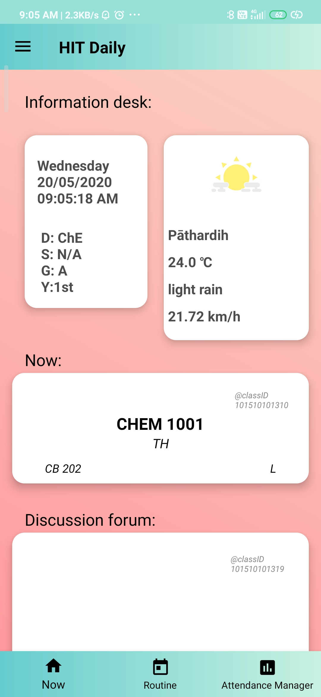
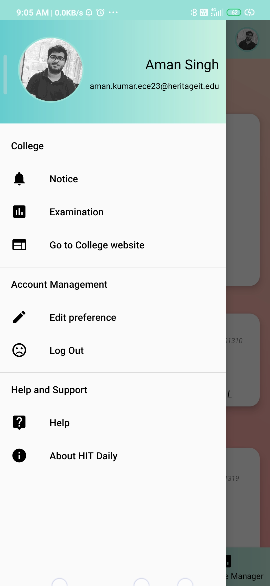

# HIT-Daily
An android application for daily routine and quick shortcuts for Heritage Institute of Technology

KEY FEATURES:
1. User can select his/her class to get all the information.
2. Onging class details such as Current Teacher, subject, room number and category.
3. Time and date view for proper assistance.
4. Weather view (Based on current location).
5. Complete routine.
6. Discussion forum (Class specific).
7. Attendance Manager.

